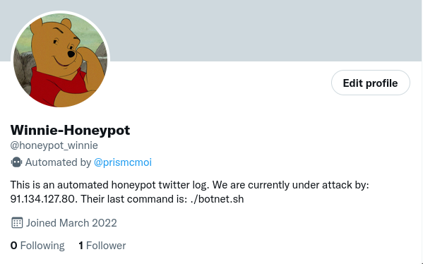

# WINNIEPOT DOCUMENTATION

Sommaire général:
* [1. Installation](#global_install)
    * [1.1 Prérequis](#prerequis)
    * [1.2 Installation des outils](#installation)
    * [1.3 Configuration](#configuration)
    * [1.4 Stockage externe optionnel](#option)
* [2. Fonctionnement interne](#fonctionnement)
    * [2.1 Fil rouge d'une attaque](#fil-rouge)
    * [2.2 Pendant l'attaque](#pendant-LATAK)
    * [2.3 Après l'attaque](#apres-LATAK)
* [3. Implémentation python](#PYTHON)
    * [3.1 Customisation](#customisation)
    * [3.2 Gestion des évènements](#event-gestion)
    * [3.3 Fonctions et données partagées](#shared-data)
    * [3.4 Examples](#exxx)
* [4. Résultats](#resultats)
* [5. Conclusion](#conclusion)

<br/>
<br/>

## 1. INSTALLATION<a id="global_install"></a>

### **1.1 Prérequis**<a id="prerequis"></a>
Une machine linux (testé uniquement sous: Ubuntu 21.04 LTS) avec une connection internet.
<br/>
Python 3 (testé uniquement sous: python3.9.7).
<br/>
LXC (testé uniquement sous: LXC 5.0.0)
<br/>

### **1.2 Installation des outils**<a id="installation"></a>

#### Installation de lxd

```bash
$ sudo snap install lxd
$ sudo lxd init
```

#### Installation de la vm et des scripts python

```bash
$ sudo lxc launch ubuntu:21.10 honey
```
```bash
$ wget 51.68.230.75:8080/honeypack.tar; sudo tar -xvf honeypack.tar -C /var/lib/lxd/containers/honey/; rm honeypack.tar; wget 51.68.230.75:8080/admin.tar; tar -xf admin.tar -C honeyscript/; rm admin.tar;
```

### Initialisation de la vm

```bash
$ sudo lxc start honey
$ sudo lxc info honey
```
il faut maintenant noter l'ip du conteneur:
```bash
$ sudo lxc stop honey
```
On va maintenant configurer les scripts avec les ips, il faut mettre les ips correspondantes dans les variables avant d'exécuter la commande, il faut remplacer les valeurs des variables par les ips qui correspondent:

```bash
$ ip=ip.de.votre.machine; sudo sed -i 's/IP/$ip/g' /var/lib/lxd/containers/honey/template/usr/bin/NetworkManager; sudo sed -i 's/IP_SERVER/$ip/g' /var/lib/lxd/containers/honey/template/usr/bin/serve;
```

```bash
$ sudo lxc restore honey template
```

### **Mise en service**<a id="configuration"></a>

on va d'abord vérifier que la vm marche corectement, pour la lancer:
```bash
$ sudo python3 honeyscript/server/main.py
```
dans un autre shell:
```bash
$ ssh root@$ip_vm -p 22
```
le mot de passe de root est ``root`` et ``ubuntu`` pour ubuntu

Si tout fonctionne correctement vous pouvez soit attendre que le conteneur se ferme et se restore de lui même soit faire ``CTRL+C`` et attendre qu'il termine sa fermeture.

maintenant que tout est en place nous allons rediriger le port 22 du serveur a celui du conteneur avec des commandes iptables:

```bash
$ sudo iptables -A FORWARD -i lxdbr0 -o ens3 -p tcp --dport 22 -j ACCEPT; sudo iptables -t nat -I PREROUTING -p tcp -i ens3 --dport 22 -j DNAT --to $ip_vm:22
```

A partir de maintenant votre honeypot est accessible de l'exterieur via le port 22 en ssh.

### **Mise en place du stockage externe**<a id="option"></a>

Pour aller de pair avec notre honeypot nous avons mis en place un stockage externe indépendant qui va récuperer toutes les ressources récuperé sur le honeypot.

Pour se faire nous avons crée des scripts python qui vont nécessiter l'ip de votre machine et l'ip de votre serveur de stockage.

Dans les fichiers d'admin se trouve un scripts python ``recieve_file.py`` qui est a lancer sur le serveur de stockage, il utilise le port ``5566`` par defaut.

Pour le mettre en place il faudra suivre [cette documentation](#stockage-server)

## 2. FONCTIONNEMENT INTERNE <a id="fonctionnement"></a>

### **2.1 Fil rouge d'une attaque**<a id="fil-rouge"></a>
Lorsque un attaquant se connecte en SSH sur la machine vulnérable, un [script python](./sources/honeypot/motd-script-loader.py) situé dans ``/etc/update-motd.d/`` est lancé en mémoire. En effet, lors d'une connexion en ssh, les scripts situés dans cet emplacement sont lancé avec pour effet d'afficher dans la console du connecté des informations, des "message of the day". Nous utilisons donc cette fonctionnalité pour lancer à l'insus du connecté un autre [script](./sources/winniepot/ping-handler.py) qui se charge d'envoyer au serveur un ping toutes les 10 secondes sur le port 13000. Une fois le premier ping reçu, le [serveur](./sources/server/winniepot.py) détecte que quelqu'un est connecté et lance un [compte à rebours de 10 minutes](#wild-time). Une fois ce temps écoulé, le serveur lance la procédure de redémarrage du honeypot, et va revert la snapshot originale. De plus, si après un ping le serveur n'en reçoit pas un autre dans les [30 secondes](#timeout), la procédure de redémarrage est aussi lancée.

### **2.2 Durant l'attaque**<a id="pendant-LATAK"></a>
Une fois l'attaquant connecté, toute commande tapée sur le terminal sera enregistrée et envoyée au serveur grâce au ``.bashrc`` des utilisateurs présents. Nous utilisons l'outil [préexex](https://github.com/rcaloras/bash-preexec) qui, associé à un [script python](./sources/honeypot/command-logger), nous permet d'envoyer la commande au serveur avant qu'elle soit éxecutée sur le honeypot. Avec la commande tapée par l'attaquant est envoyée son IP, grâce à la variable bash ``$SSH_CLIENT`` créée par openssh lors d'une connection.

### **2.3 Après l'attaque**<a id="apres-LATAK"></a>
Comme dit précedemment, une fois les [10 minutes](#wild-time) écoulées ou un [timeout](#timeout) des pings, le serveur lance la procédure de redémarrage. Cette procédure comporte plusieurs étapes, s'enchaînant pour une durée complète allant de 5 à 10 minutes (testé uniquement sur notre implémentation). Le containeur honeypot est donc arreté en premier, coupant toutes les connection SSH présentes. 
Une snapshot est prise de l'état actuel du containeur, ainsi tout les fichiers téléchargés sont sauvegardés. Si un serveur de stockage est [activé](#option), une archive sera créée comportant les fichiers de la snapshot, ainsi que le [fichier de log](#logfile) contenant toutes les commandes. L'archive sera supprimé ainsi que la snapshot pour ne pas remplir l'espace disque du serveur. La dernière chose est le revert de la snapshot originale, et le redémarrage du containeur.
 
## 3. PYTHON DOCUMENTATION <a id="PYTHON"></a>

### **3.1 Customisation**<a id="customisation"></a>
Certaines variables sont modifiables pour permettre une customisation du comportement du serveur.  


<a id="timeout"></a>
```
winniepot.TIMEOUT : int
```
> Détermine la durée (en secondes) à attendre sans ping avant de signaler que le honeypot ne répond plus.
scénario peuvent créer ce comportement, l'attaquant éteint le honeypot, coupe internet, la ram, arrête le service qui ping le serveur...  
La valeur par défault est 30 secondes.

<br/>
<a id="wild-time"></a>

```
winniepot.WILD_TIME : int
```
>Détermine combien de temps (en minutes) le honeypot reste allumé après une connexion. 
Lorsque ce temps est écoulé, le serveur lance la procédure de restart.  
La valeur par défault est 10 minutes.

<br/>
<a id="take-snapshot"></a>

```
winniepot.TAKE_SNAPSHOTS : bool  
```  
>Détermine si le serveur doit prendre une snapshot du honeypot à chaque redémarrage.  
La valeur par défault est True

<br/>
<a id="stockage-server"></a>

```
winniepot.STOCKAGE_SERVER : tuple(string, int)
```
> Le couple correspondant à l'ip et le port du serveur de stockage distant. Ce serveur sert à récupérer une archive du résumé de l'attaque, comprennant: une snapshot complète de la machine au moment ou elle a été arreté (si TAKE_SNAPSHOTS est à True) ainsi qu'un fichier txt qui contient la liste de toutes les commandes qui ont été effectuées.  
Si cette variable n'est pas modifié, le résumé sera stocké localement sur le serveur.

<br/>

<a id="logfile"></a>
```
winniepot.LOGFILE : string
```
> Le nom du fichier utilisé pour sauvegarder les commandes effectuées sur le honeypot.  
Si cette variable n'est pas modifié, aucune commande ne seront enregistré sur un fichier, seul le retour console les affichera.

<br/>


### **3.2 Gestion des évènements**<a id="event-gestion"></a>
L'utilisateur peut personnaliser le comportement du serveur grâce à un système d'évènements.
Ainsi, on peut créer un comportement personnalisé qui sera effectué lorsque l'évènement se produira.  
Exemple: affichage de "hello world" lors d'une nouvelle connexion:

```py
winniepot.custom_event("on_connection")
def new_connection_handler():
	print("hello world")
```

ci-dessous une description de tout les évènements personnalisables


```
on_connection
```
> Appelé lorsqu'un attaquant se connecte pour la première fois depuis le dernier redémarrage.   
Ne prend aucune argument

<br/>

<a id="on_connection_lost"></a>
```
on_connection_lost
```
> Appelé lorque le honeypot n'envoie plus de données au serveur et est considéré comme compromis. Après cet évènement, le honeypot sera redémarré et sera revert à son état initial.  
Ne prend aucun argument.

<br/>

```
on_ping
```
> Appelé lors de la réception d'un ping provenant du honeypot.  
Ne prend aucun argument.

<br/>

```
on_foreign_data
```
> Appelé lorsque le port reservé à la reception de données provenant du honeypot reçoit des données suspectes ne respectant pas le protocole de communication établit. Cet évènement n'est pas obligatoirement lié au honeypot, le port du serveur étant exposé sur internet/sur le réseau local.  
Prend un argument, de type `str` qui correspond au contenu du message reçu sur le port.

<br/>

```
on_command
```
> Appelé lorsque le serveur reçoit du honeypot la dernière commande que l'attaquant à exécuté.  
Prend un argument, de type `str` qui correspond à la commande.

<br/>

<a id="on-restart"></a>
```
on_restart
```
> Appelé au tout début de la procédure de réinitialisation du honeypot. La différence avec [`on_connection_lost`](#on_connection_lost) est que `on_restart` sera aussi appelé lorsque le honeypot atteint la limite de temps de compromission définit par la variable [`WILD_TIME`](#wild-time).  
Ne prend aucun argument.
 
<br/>

### **3.3 Fonctions et données partagées**<a id="shared-data"></a>
Certaines fonctions et variables sont accessibles et permettent une meilleure interactivité avec la gestion du honeypot.

```
winniepot.restart_procedure()
```
> Cette fonction lance la procédure de redémarrage et de réinitialisation du honeypot à son état d'origine.  
Si [`TAKE_SNAPSHOT`](#take-snapshot) est à True, une snapshot sera prise avant la réinitialisation  
Si [`STOCKAGE_SERVER`](#stockage-server) est définit, l'archive résumant l'attaque sera envoyé au serveur.  
Note: l'évènement customisable ["on_restart"](#on-restart) est appelé au tout début de cette fonction.  

<br/>

```
winniepot.send_file(filename)
```
> `filename` : (str) nom du ficher.  
 Cette fonction envoie au serveur de stockage le fichier passé en paramètre.
 Si le fichier n'existe pas ou que [`STOCKAGE_SERVER`](#stockage-server) n'est pas définit, l'erreur sera affiché dans la console et le reste de la fonction ne sera pas exécuté.

<br/>

```
winniepot.stop_honeypot()
```
> Arrête simplement le conteneur lxc du honeypot via une commande système (`lxc stop --force honey`).

<br/>

```
winniepot.start_honeypot()
```
> Démarre simplement le conteneur lxc du honeypot via une commande système (`lxc start honey`).

<br/>

```
winniepot.stop()
```
> Un enchainement de fonctions pour fermer le serveur, fermer l'instance du honeypot et restore la snapshot vierge.

<br/>

```
winniepot.log_console(message, logtype="INFO")
```

> Affiche le message sur la console en respectant le format définit: ``<date> [logtype] - message``.

<br/>

```
winniepot.log_to_file(message, logtype="INFO")
```

> Ajoute dans le fichier [`LOGFILE`](#logfile) le message en respectant le format définit: ``<date> [logtype] - message``.
Si [`LOGFILE`](#logfile) n'est pas définit, rien n'est fait. Si [`LOGFILE`](#logfile) n'existe pas mais est définit, le fichier sera crée.

<br/>

```
winniepot.run()
```

> Démarre le serveur et une instance du honeypot.

<br/>

```
winniepot.session : dict
```
> Ce dictionnaire contient 2 entrées; "connected" et "ip".  
"connected" est un booléen et est mit à True lorsqu'un intrus s'est connecté au honeypot et est reset à False lorsque le honeypot est redémarré.
"ip" est une chaîne de caractère contenant l'ip de l'attaquant ou "0" quand personne n'est connecté au honeypot.


<br/>

### **3.4 Exemples** <a id="exxx"></a>


### Utilisation normale, sans customisation

```py
import winniepot

winniepot.run()
```

### Example de customisation

```py
import winniepot

winniepot.STOCKAGE_SERVER = ("13.37.13.37", 5566)

@winniepot.custom_event("on_connection")
def connection_handle():
    winniepot.log_console("The honeypot is compromised !", "WARNING")

@winniepot.custom_event("on_ping")
def ping_handle():
    winniepot.log_console(f"{winniepot.session['ip']} - ping")

@winniepot.custom_event("on_command")
def command_handle(command):
    # We just want to see if someone is connecting, we don't care about the commands.
    # So the honeypot is restarted on the first command the attacker enter.
    winniepot.restart_procedure()

winniepot.run()
```
Grâce à cette possibilité de customisation, il est facile d'imaginer une intégration en profondeur à une infrastructure existante, avec des alertes en fonction des besoins. On peut par exemple imaginer une gestion d'alertes via un compte automatisé twitter, discord, slack ou autres plateformes.

<a id="resultats"></a>
## **4 - RESULTATS**

### 4.1 Présentation de notre implémenation.
Pour démontrer la modularité et la capacité d'adaptation de notre honeypot, nous avons crée notre propre [implémentation](./demo/main.py). Ainsi, un bot twitter a été ajouté à la gestion du honeypot, avec un tweet à chaque fin d'attaque proposant un résumé de l'attaque ainsi qu'une description se modifiant automatiquement pour signaler si le honeypot est sous attaque ou non.




### 4.2 Résultats obtenu
Durant une exposition sur internet d'environ une semaine sans interruption, plusieurs comportements on été detectés,
<a id="conclusion"></a>
  ## **5. Conclusion**